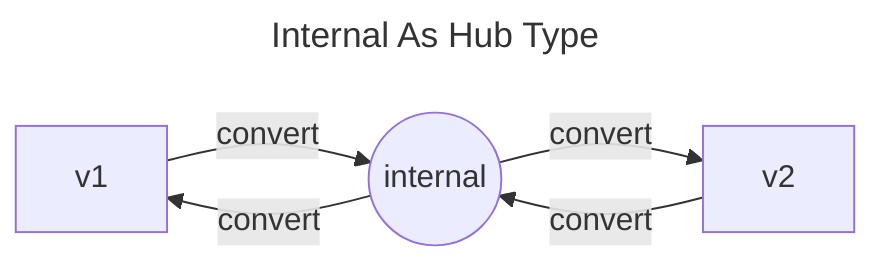

# x-kubernetes

## API

The Kubernetes API is organized into API groups:
- The core (also called legacy) group is found at REST path `/api/v1`. The core group has no group name and uses `apiVersion: v1`.
- The named groups are at REST path `/apis/$GROUP_NAME/$VERSION` and use apiVersion: `$GROUP_NAME/$VERSION` (for example, apiVersion: batch/v1).

The official document [Custom Resources] provides an introduction to API Extension. Users can integrate their third-party API into Kubernetes in one of two ways:
- **CustomResourceDefinitions**, as detailed in [Extend the Kubernetes API with CustomResourceDefinitions] 
- **API Aggregation**, as explained in [Kubernetes API Aggregation Layer]

In the past, I spent lots of time to reading these documents, only to find that understanding the concept of Kubernetes API Extension was challenging. I eventually realized that the best way to comprehend something is to implement it from scratch.

[apiserver-from-scratch] is a 500-line Golang apiserver built from scratch, using only `k8s.io/apimachinery` and a few utility libraries. It integrates its namespaced resources, called `foos`, into Kubernetes with the groupVersion `hello.zeng.dev/v1`.

Essentially, an apiserver in Kubernetes is an HTTP server that provides a RESTful API. The built-from-scratch apiserver provides these resources and verbs:
- /apis/hello.zeng.dev/v1/foos (list)
- /apis/hello.zeng.dev/v1/namespaces/{namespace}/foos (list, create)
- /apis/hello.zeng.dev/v1/namespaces/{namespace}/foos/{name} (get, put, patch, delete)

The Foo kind behind the foos resource is very simple:

```
apiVersion: hello.zeng.dev/v1
kind: Foo
metadata:
  name: test
spec:
  msg: testmsg
  msg1: 'hi, there👋'
```

The endpoints `/apis`, `/apis/hello.zeng.dev` and `/apis/hello.zeng.dev/v1` are for service discovery. They help kubectl detect resource information:
- Its resource name is foos
- It has a short name fo
- Its kind is Foo
- The foos is a namespaced resource

Therefore, `kubectl get fo` is mapped to the HTTP endpoint `/apis/hello.zeng.dev/v1/namespaces/default/foos`, and `kubectl delete fo myfoo` to `/apis/hello.zeng.dev/v1/namespaces/default/foos/`.

RESTMapper, which forms the basis of object encoding and decoding in Kubernetes, is also supported by the discovery API.

The endpoint `/openapi/v2` produces the OpenAPI Schema of our apiserver. Once an APIService is created in Kubernetes, the schema will be aggregated to the kube-apiserver's endpoints `/openapi/v2` and `/openapi/v3`. All requests prefixed with `/apis/hello.zeng.dev/v1/` are forwarded to our apiserver.

```yaml
apiVersion: apiregistration.k8s.io/v1
kind: APIService
metadata:
  name: v1.hello.zeng.dev
spec:
  service:
    name: apiserver
    namespace: hello
  group: hello.zeng.dev
  version: v1
  insecureSkipTLSVerify: true
```

While not all features in the document [Kubernetes API Concepts] are implemented by [apiserver-from-scratch], it captures the key points. It serves as a great starting point for learning how API Aggregation works in Kubernetes. Details are covered in my Chinese blog post [simple K8s apiserver from scratch].

After following [kubernetes/api] and learning `make target` in [kubernetes/kubernetes], the HTTP RESTful resources of [apiserver-from-scratch] transform into types in the [x-kubernetes/api] module. Components such as Protobuf files, default functions, deepcopy functions, and clients are generated using [kube-code-generator].

This sets the stage for [apiserver-using-library], which implements a fully-featured api-server using the k8s.io/apiserver library.

Initially, [apiserver-using-library] stores resource objects in memory, like [apiserver-from-scratch]. Later, etcd is added as another storage option. These two storages can be switched between using the `--enable-etcd-storage` option.

Building upon etcd storage, the API in [apiserver-using-library] evolves into a new version, `v2`, also referred to as `hello.zeng.dev/v2`.

```yaml
apiVersion: hello.zeng.dev/v2
kind: Foo
metadata:
  name: myfoo
spec:
  config:
    msg: testmsg
    msg1: "hi, there👋"
  image: nginx
status:
  conditions:
  - status: "False"
    type: Worker
  - status: "True"
    type: Config
  phase: Processing
```

This modification pave the way for building a controller that helps running workloads in Kubernetes. Once a `Foo` is created in the cluster, the controller can place `spec.config.msg` and `spec.config.msg1` in ConfigMap or Pod's Env, and then run the `spec.image` in a Pod to consume these configurations.

The most challenging part of a multi-version API in Kubernetes is the conversion between different versions. [apiserver-using-library] follows best practice in [kubernetes/kubernetes] by defining an internal version as the hub version of all versions.



I've written a Chinese blog post about this philosophy in [best practice for K8s api multi-version conversion].

Subresources are also implemented in pull request [#1] for [apiserver-using-library]:
- foos/status ↔️ pod/status
- foos/config ↔ deployments/scale
- foos/base64 ↔️ serviceaccounts/token

The base64 subresource, similar to the token subresource in kube-apiserver, only supports POST, and returns a different kind different from the main resource.

```bash
curl -s -X POST -H "Content-Type: application/json" localhost:8001/apis/hello.zeng.dev/v1/namespaces/default/foos/myfoo/base64 -d '{
"apiVersion": "transformation.zeng.dev/v1beta1",
"kind": "Base64",
"spec": {"fieldPath": "spec"}
}'
{
  "kind": "Base64",
  "apiVersion": "transformation.zeng.dev/v1beta1",
  "metadata": {
    "namespace": "default"
  "spec": {
    "fieldPath": "spec"
  },
  "status": {
    "output": "eyJtc2ciOiJ0ZXN0bXNnIiwibXNnMSI6ImhpLCB0aGVyZfCfkYsifQ=="
  }
}
```

The [disallow admission control implementation] of [apiserver-using-library] is quite simple. It helped me understand the admission control in [kubernetes/kubernetes] and the emergence of policy systems. The details are covered in my blog post [K8s API Admission Control and Policy].

Details of [apiserver-using-library] are covered in my Chinese blog post [Implement K8s apiserver using library]. Following this, it's time to read my post [K8s apiserver aggregation internals] for a comprehensive understanding of Kubernetes API Aggregation.

I've also tried implementing the apiserver atop the [x-kubernetes/api] using a runtime framework. However, I found its extensibility quite limited. That's why I wrote this post [Why custom K8s apiserver should avoid runtime?]

CustomResourceDefinitions (CRD) can be generated from Go types. This project generates CustomResourceDefinitions for hello.zeng.dev/v1 and `hello.zeng.dev/v2` using the script [update-crd-docker.sh].

Installing CRDs into the cluster is equivalent to having an api-server embedded in kube-apiserver. A module in kube-apiserver will load CRDs and install REST endpoints in kube-apiserver automatically. The details are covered in my Chinese post [K8s CustomResourceDefinitions (CRD) internals].

The philosophy of multi-version conversion for CRDs is the same for both CRD and custom apiserver. This is also covered in [best practice for K8s api multi-version conversion].

Writing an apiserver is more complex than using CRD, but it offers users more functionality and extensibility, such as arbitrary subresources, storing resource as protobuf, and patch supports. The official document [Custom Resources] provides detailed differences between CRD and custom apiserver.

In summary, for most cases, CRD is sufficient. In my opinion, writing an API server is more fun.

## controllers
//todo

## network, sheduler, etc...
//todo 


<!-- links -->
[Kubernetes API Aggregation Layer]: https://kubernetes.io/docs/concepts/extend-kubernetes/api-extension/apiserver-aggregation/
[Extend the Kubernetes API with CustomResourceDefinitions]: https://kubernetes.io/docs/tasks/extend-kubernetes/custom-resources/custom-resource-definitions/
[Custom Resources]: https://kubernetes.io/docs/concepts/extend-kubernetes/api-extension/custom-resources/

[Kubernetes API Concepts]: https://kubernetes.io/docs/reference/using-api/api-concepts/
[kubernetes/kubernetes]: https://github.com/kubernetes/kubernetes
[kubernetes/api]: https://github.com/kubernetes/api
[kube-code-generator]: https://github.com/phosae/kube-code-generator

[apiserver-from-scratch]: ./apiserver-from-scratch/
[x-kubernetes/api]: ./api/
[apiserver-using-library]: ./api-aggregation-lib/

[update-crd-docker.sh]: ./api/hack/update-crd-docker.sh

[#1]: https://github.com/phosae/x-kubernetes/pull/1
[disallow admission control implementation]: https://github.com/phosae/x-kubernetes/commit/c2bfa30485677249374dbb582e8a111c0b897f0c

<!-- blog posts about x-kubernetes -->
[simple K8s apiserver from scratch]: https://zeng.dev/post/2023-k8s-apiserver-from-scratch
[Implement K8s apiserver using library]: https://zeng.dev/post/2023-k8s-apiserver-using-library
[best practice for K8s api multi-version conversion]: https://zeng.dev/post/2023-k8s-api-multi-version-conversion-best-practice
[K8s apiserver aggregation internals]: https://zeng.dev/post/2023-k8s-apiserver-aggregation-internals
[Why custom K8s apiserver should avoid runtime?]: https://zeng.dev/post/2023-k8s-apiserver-avoid-using-runtime
[K8s API Admission Control and Policy]: https://zeng.dev/post/2023-k8s-api-admission

[K8s CustomResourceDefinitions (CRD) internals]: https://zeng.dev/post/2023-k8s-api-by-crd