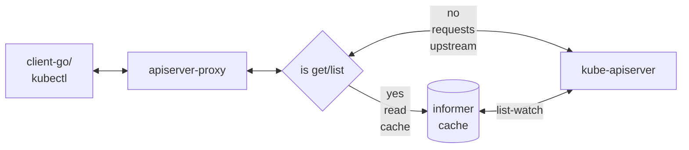

# apiserver-proxy

The apiserver-proxy works as middle proxy between client-go/kubectl and kube-apiserver. 

When handle `get/list` requests, the apiserver-proxy firstly list/watch resources from kube-apiserver. 
All subsequence `get/list` requests are returned from cache.

Requests with verbs `watch/post/patch/update/delete` are forwarded to kube-apiserver.



## setup and basics
set up K8s with [KinD](https://kind.sigs.k8s.io/), 
and our custom apiserver provides resources `hello.zeng.dev/v1/foos` and `hello.zeng.dev/v2/foos`

```bash
cd .. && make localenv && cd api-aggregation-lib && make deploy && cd -
```
create some foos and pods

```bash
kubectl apply -f ../api/artifacts/samples/hello-foo.yml && \
    kubectl create deploy web --image nginx:alpine --replicas=2
```

deploy the apiserver-proxy

```
make deploy
```

interact with the apiserver-proxy

test with official resources

```bash
# on the top terminal
KUBECONFIG=./config.pxy kubectl get po -w
NAME                   AGE
web-694fcfd956-hl9x6   2m29s
web-694fcfd956-s5wzf   2m29s
NAME                   READY   STATUS    RESTARTS   AGE
web-694fcfd956-hl9x6   1/1     Running   0          2m29s
web-694fcfd956-s5wzf   1/1     Running   0          2m29s
web-694fcfd956-s5wzf   1/1     Terminating   0          2m37s
web-694fcfd956-hl9x6   1/1     Terminating   0          2m37s

---
# on the bottom terminal
kubectl delete deploy web
```

test with 3rd resources

```bash
KUBECONFIG=./config.pxy kubectl get fo -A 

NAMESPACE     NAME    AGE
default       test    5m56s
kube-public   myfoo   5m56s
default       myfoo   5m56s
```

## authn/authz
The service account `hello/apiserver` doesn't have permission to list pods.

```bash
../hack/gen-sa-kubeconfig.sh hello apiserver

KUBECONFIG=./hello-apiserver.kubeconfig kubectl get po
Error from server (Forbidden): pods is forbidden: User "system:serviceaccount:hello:apiserver" cannot list resource "pods" in API group "" in the namespace "default"
```

When the apiserver-proxy handles the request, it still obey the upstream kube-apiserver's authn/authz.

```
sed -i 's~server: https://[^:]*:[0-9]*~server: https://172.18.0.2:30443~g' hello-apiserver.kubeconfig

KUBECONFIG=./hello-apiserver.kubeconfig kubectl get po
Error from server (Forbidden): pods is forbidden: User "system:serviceaccount:hello:apiserver" cannot list resource "pods" in API group "" in the namespace "default"
```

## known issues

The `Table` representation, as requested by kubectl, are implemented by [upstream apiserver](https://github.com/kubernetes/kubernetes/blob/cc2f7b319801e1fd983a09e2442001e44010827b/staging/src/k8s.io/apiserver/pkg/endpoints/handlers/response.go#L40-L94).

```
curl -H "Accept: application/json;as=Table;v=v1;g=meta.k8s.io,application/json;as=Table;v=v1beta1;g=meta.k8s.io,application/json" \
'127.1:8001/api/v1/namespaces/default/pods?limit=500'
```

It is not supported by the apiserver-proxy now

```bash
kubectl get svc -o wide
NAME         TYPE        CLUSTER-IP   EXTERNAL-IP   PORT(S)   AGE   SELECTOR
kubernetes   ClusterIP   10.96.0.1    <none>        443/TCP   30m   <none>

KUBECONFIG=./config.pxy kubectl get svc -o wide
NAME         AGE
kubernetes   30m
```

## other kube-apiserver proxy implementations
1. [superedge/lite-apiserver](https://github.com/superedge/superedge/pull/53/files)
2. [amimof/multikube](https://github.com/amimof/multikube)

Other than using informer cache, these proxies cache response bytes.